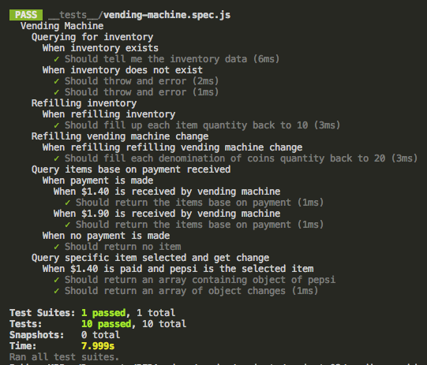

# Project 3 - Vending Machine TDD
This project focused on using test driven development to build a simple vending machine application. Test for this project was planned and built out before functionality was implemented. Jest was used for the TDD to test the javascript

## Built With

* [JavaScript](https://www.javascript.com/) 
* [NODE](https://nodejs.org/en/)
* [JEST](https://facebook.github.io/jest/)

## Screenshot
Below is a screenshot of the test

## Author
Bobby Soetarto